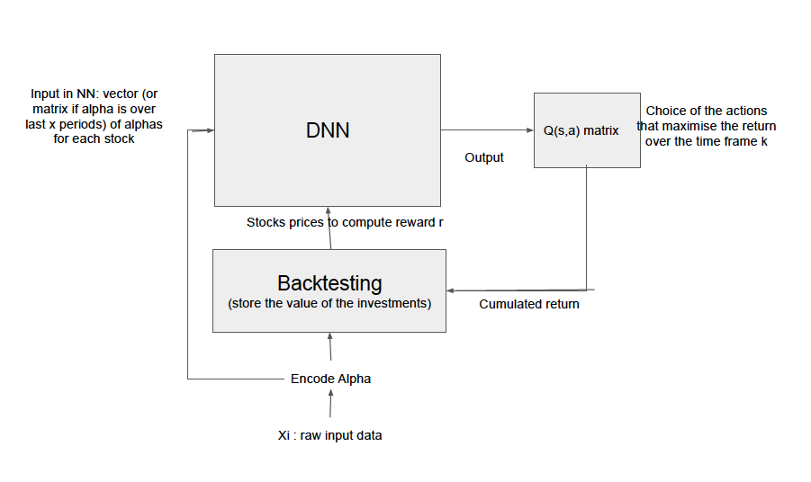

# cs230-project
# Deep Reinforcement Learning framework for Factor Investing

## Project description

### Context 

Deep Learning for finance has always been applied through a wealth of techniques and network architectures to try to 
predict the evolution of financial instruments and specifically stock markets. A diversity of new sources such as 
tweets have also being used to gain superior predictive power. We suggest in this project for the course 
[CS230-Deep Learning](https://cs230.stanford.edu) to apply feature knowledge 
used in factor investing to evaluate if a Q-learning network can better identify investments opportunities 
in the equity markets. 

### Approach

Several methods such has for example the Kalman filter have been used at identifying and correcting forecasts 
as the market reveals more information as time updates. 
* Factor investing pioneered by [FamaFrench](#citation) has set the base of Quantitative Investment with the 3 factors: 
size of firms, book-to-market values and excess return on the market. 
* [KahnGinold](#citation) introduced the concept of the selection of factors with the _Information Ratio (IR)_ that
consists of a measure of the value added per unit of risk of each independent factors 
(_Information Coefficient (IC)_) times how often that factor can be put in use in a trading setting (_Breadth_). 

Thus, historically, factor investing has focused on identifying factors returns and their respective correlations 
to generate superior returns. Methods have ranged from ordering factor Z-scoring, moving-average z-score as 
presented in [QuantEquity](#citation).

To investigate the methods of Deep Learning in a context of identifying factors and their Information Coefficient to 
implement factor investing, [DRLinPort](#citation) and [FactorInRL](#citation) point in interesting directions in using 
Deep Reinforcement Learning. [DRLinPort](#citation)compares different type of Neural Networks (LSTM, CNN, RNN ) 
to build optimal Portfolio through policy functions. [FactorInRL](#citation) is more interesting in focusing in factor 
investment by building a genetic algorithm to select the factors that will build the portfolio.  
[DRLinPort](#citation) notably mention the fact that the genetic algorithm is superior in that it will not be subject of 
several local minimum compared to gradient descent methods.

This project plans to investigate/build the model below that identifies _IC_ factors though a policy function by 
forecasting rewards with simulation of expected returns. 


## Model 

Model Description:




* Dimensionality of the features W<sub>n<sub>m</sub>,n<sub>z</sub></sub> in the _DNN_
    * n<sub>m</sub> with the number of stocks from the S\&P500 selected,
    * n<sub>z</sub> the number of alpha-factors under consideration
* State: represent the vector of the positions in stock
* Agent: the agent is simply be the change of positions in the n<sub>m</sub> stocks that maximises the returns r<sub>k</sub>
  over the horizon _k_. That would be based on a _Q_-table using states of each of the stocks and the actions for each stock

[KahnGinold](#citation) Information Coefficient (IC) and alpha formula: 

<div align="center">
    
</div>


### Data: Data for Financial Markets uploaded with Information Coefficients Calculations. 

```
Structure:
	Readme.md
	/Data-snapshot
		/Commodities
		/Commodities Static
		/Description
		/Economic
		/Economic Poll
		/Economic Static
		/Futures
		/Futures Static
		/FX
		/FX Static
		/Index
		/Index Static
		/Interest Rates
		/Interest Rates Static
		/Options Index
		/Options Index Static
		/US Stocks
		/US Stocks Static
	/Data-processed
	/Data-factor
	/Output
    /project_report
        CS230_project_report.pdf
```

Data description:
* "Data-snapshot" ("Data" can be obtained through downloading at [DataStream Refinitiv](http://solutions.refinitiv.com/datastream-macroeconomic-analysis/?utm_content=Refinitiv%20Brand%20Product-UKI-EMEA-G-EN-BMM&utm_medium=cpc&utm_source=google&utm_campaign=68832_RefinitivBAUPaidSearch&elqCampaignId=5917&utm_term=%20+refinitiv%20+datastream&&gclid=EAIaIQobChMImtHOtIfj5QIVVoXVCh1sSQPDEAAYASAAEgIb5_D_BwE)) contains the raw time-series of market informations (Stocks, Commodities, Economic information, Futures, Currencies(FX), Stock and Credit Indices, Interest Rates, Options on Stock Indices). "Static" extension contains the information describing the nature of the financial contracts, i.e. for a stock options: the expiry, the underlying stock, the name of the contract: Put or Call, etc.

* "Data-processed" contains the information of raw time-series grouped along the time axis $t$ split in 2 arrays: 
_(Not uploaded  - Currenty under development)_
  * __data_stocks__ collects from "Data-snapshot" the time-series of the values of the stocks to help compute the $Q(s,a)$ function by simulating the value of the agent composition of the positions searched. 
  * __mrkt_info__ collects from "Data-snapshot" the time-series of the market conditions such as the implied volatility, the momentum factors, positions of currencies, oil prices etc. This data is usefull in constructing the Information Coefficient (IC) factors that will feed the Deep Neural Network in the model. This is the dataset used for the Back-testing in the model.
  * __mrkt_info__ collects from "Data-snapshot" the time-series of the market conditions such as the implied volatility, the momentum factors, positions of currencies, oil prices etc. This data is usefull in constructing the Information Coefficient (IC) factors that will feed the Deep Neural Network in the model.
  
* "Data-factor" contains the time-series of factors build from __mrkt_info__ that will feed the DNN in the model.

* "Output" contains the time-series of the positions taken by the _Q(s,a)_ function.


## Citation


```
@article{FamaFrench,
  title   = "Common risk factors in the returns on stocks and bonds",
  journal = "Journal
of Financial Economics" ,
    volume  = "33",
  pages   = "3--56 ",
  year    = "1993",
  author  = "Fama, E. F. and K. R. French"
}
```

```
@article{KahnGinold,
  title   = "Active Portfolio Management : A quantitative approach for producing superior returns and selecting superior money managers",
  journal = "McGraw-Hill Education" ,
  pages   = "-- ",
  year    = "1999,
  author  = "R. Grinold and R. Kahn"
}
```

```
@book{QuantEquity,
  title   = "Quantitative equity portfolio management: Modern techniques and applications",
  publisher = "Chapman and Hall/CRC Financial Mathematics Series." ,
  pages   = "462",
  year    = "2007,
  author  = "E. E. Qian, R. H. Hua, E. H. Sorensen"
}
```

```
@article{DRLinPort,
  title   = "A deep reinforcement learning framework for the financial portfolio management problem",
  journal = "Xi’an Jiaotong-Liverpool University",
  pages   = "-- ",
  year    = "Jul 2017",
  doi     = "–doi:arXiv:1706.10059v2.",
  author  = "Z. Jiang, D. Xu, J. Liang"
}
```

```
@article{FactorInRL,
  title   = "Factor Selection with Deep Reinforcement Learning for Financial Forecasting",
  journal = "University of Chicago, McKinley Capital Management",
  pages   = "-- ",
  year    = "Oct 2018",
  doi     = " https://ssrn.com/abstract=3128678",
  author  = "Ziwei Wang and Nelson Leung"
}
```

## License

Released under MIT License. See [LICENSE][license] for details.
